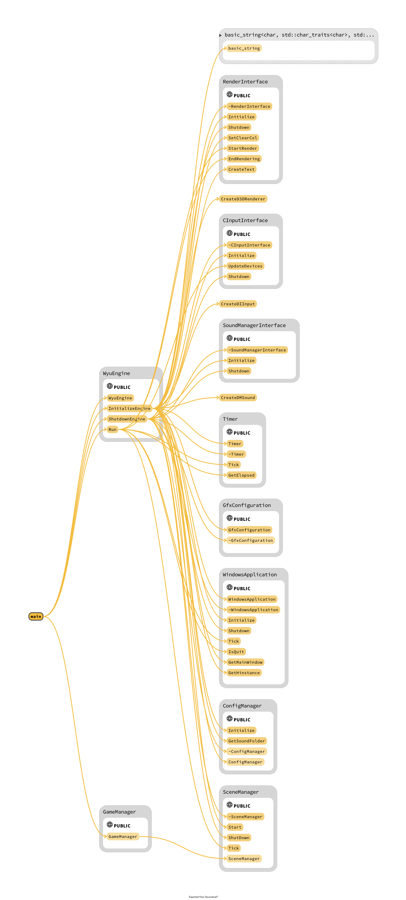

# wyuEngine
  本プロジェクトは[CMake](https://cmake.org/)を使って作成しています。
wyuEngineは、C++で開発された2D/3Dゲームエンジンです。

## 機能の説明
### ゲームオブジェクト
wyuEngineでは、ゲームオブジェクトを作成して、ゲームの世界を構築できます。ゲームオブジェクトには、座標、速度、角度、大きさなどの属性を設定できます。

### 描画システム
wyuEngineは、画面にオブジェクトを描画するためのシステムを提供しています。画像や図形を表示することができます。

### 入力の処理
wyuEngineでは、キーボードやマウスの入力を簡単に処理できます。キーの押下状態を確認したり、マウスの座標を取得したりすることができます。

### 衝突判定
wyuEngineでは、2つのゲームオブジェクトの衝突を簡単に判定できます。衝突した場合は、ゲームオブジェクトの属性を変更することができます。

### 音楽再生機能
wyuEngineは、音楽再生機能を提供しています。BGMや効果音を再生することができます。

### JSONファイルからのゲームオブジェクトの読み込み機能
wyuEngineは、JSONファイルからゲームオブジェクトを読み込む機能を提供しています。この機能を利用することで、ゲームオブジェクトを容易に作成することができます。

以上は、wyuEngineで利用可能な主な機能の一部です。詳細な使用方法については、サンプルプログラムを参照してください。

## ビルド環境
Win10/Win11
c++14以上のバージョンビルドできるコンパイラ
CMake3.19以上のバージョン

## 実行環境

Win10,Win11

## インストール手順
1. このリポジトリをクローンします。
```
git clone https://github.com/wuyukwi/wyuEngine.git
```
2. クローンしたフォルダに移動します。
```
cd wyuEngine
```
3. build.batを実行してください。このバッチファイルはプロジェクトを生成し、wyuEngineのDebug構成を自動的にビルドします。
また、以下のコマンドを使用して最初にVisual Studioプロジェクトを生成し、ビルドディレクトリ内のソリューションを開いて手動でビルドすることもできます。
```
cmake -B build

cmake --build build --config Debug
```

## 外部ライブラリー
1. DirectX 9.0c
2. xaudio2
3. DirectInput／XInput
4. [Dear ImGui](https://github.com/ocornut/imgui)
5. [json11](https://github.com/dropbox/json11)

## エンジンフォルダの説明

1. engine/3rdparty
外部ライブラリーを保存用フォルダ

2. engine/include
エンジンヘッダファイルを保存用フォルダ

3. engine/source
エンジンソースファイルを保存用フォルダ

## ソースコード説明
wyuEngineは拡張性のために仮想基底クラス多く使われてます、下の構造図を参考してください。

### 構造図
<p align="center">
    
  </a>
</p>

## エンジンの使用方法
Demoフォルダのソースコートにコメント書いてますので参考してください。
### フォルダの説明
#### Demo
1. Demo/include
アプリケーションヘッダファイルを保存用フォルダ
2. Demo/source
アプリケーションソースファイルを保存用フォルダ
3. Demo/asset
アプリケーションのアセットを保存用フォルダ
4. Demo/configs
アプリケーションの設定とフォルダのパスなどを設定するsetting.iniファイルを格納する場合。
5. Demo/configs/deployment
書き出した実行ファイルに使う設定
6. Demo/configs/development
デバッグの時に使う設定
7. Demo/bin
書き出した実行ファイルを保存用フォルダ

#### game
2DシューティングゲームのDemo、フォルダの構造は上と同じです。

### ライセンス
このソフトウェアはMITライセンスの下で公開されています。詳細については、LICENSEファイルを参照してください。
